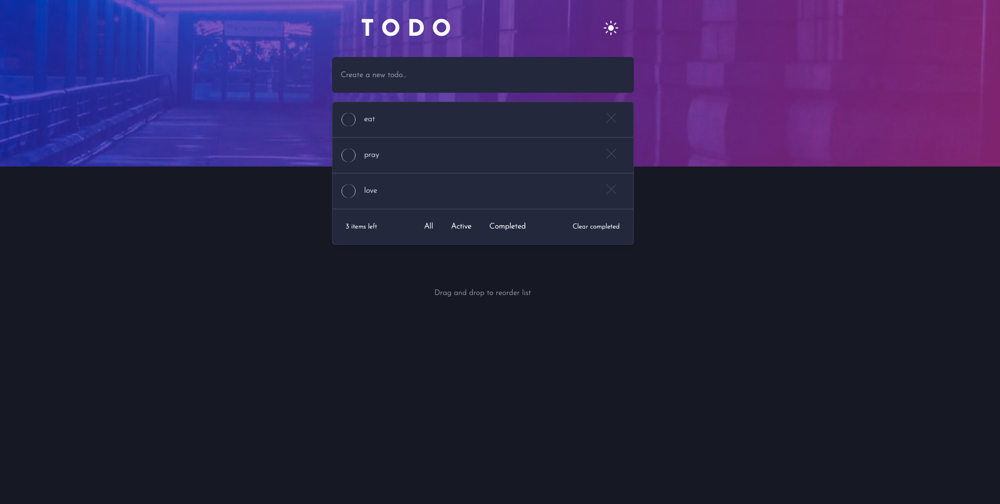
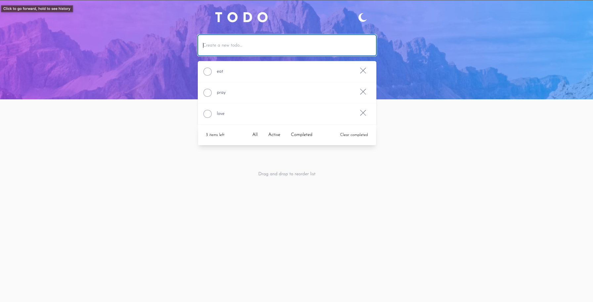
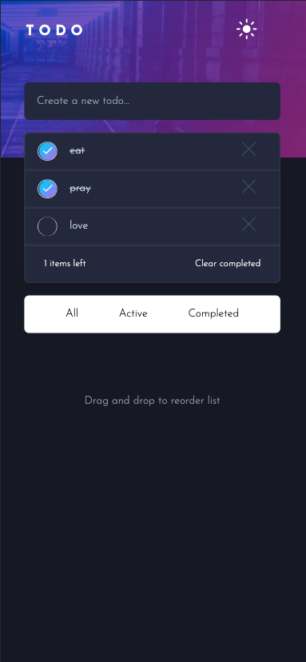

# Frontend Mentor - Todo app solution

This is a solution to the [Todo app challenge on Frontend Mentor](https://www.frontendmentor.io/challenges/todo-app-Su1_KokOW).

## Table of contents

- [Overview](#overview)
  - [The challenge](#the-challenge)
  - [Screenshot](#screenshot)
  - [Links](#links)
- [My process](#my-process)
  - [Built with](#built-with)
  - [What I learned](#what-i-learned)
  - [Continued development](#continued-development)
- [Author](#author)

## Overview

### The challenge

Users should be able to:

- View the optimal layout for the app depending on their device's screen size
- See hover states for all interactive elements on the page
- Add new todos to the list
- Mark todos as complete
- Delete todos from the list
- Filter by all/active/complete todos
- Clear all completed todos
- Toggle light and dark mode
- **Bonus**: Drag and drop to reorder items on the list

### Screenshot

### Links

- Solution URL: [https://github.com/R3sty/todo-app]
- Live Site URL: [https://r3sty.github.io/todo-app/]

## My process

### Built with

- [React](https://reactjs.org/) - JS library
- [TailwindCSS](https://tailwindcss.com/) - For styles

### What I learned

Hello there,

I'm excited to share with you what I've learned while working on this project.

Firstly, I've strengthened my knowledge of TypeScript, particularly when it comes to passing props between components. TypeScript has been incredibly helpful in ensuring that I catch any errors early on in the development process, and it's helped me write more robust code.

Secondly, I learned more about setting themes for my project. This has allowed me to make my app look more cohesive and visually appealing. I've also gained a better understanding of how to use CSS to style my components and make them look the way I want them to.

Thirdly, I've become more comfortable working with conditional statements. This has allowed me to make my app more dynamic, enabling it to respond better to user interactions. I've also gained a better understanding of how to use conditional rendering to make my app more responsive.

Lastly, I've learned more about responsive design. This has been essential for ensuring that my app works well on different devices, including desktops, tablets, and mobile phones. I've gained a better understanding of how to use media queries and other techniques to create a responsive design that looks great on all devices.

Overall, this project has been a great learning experience for me. I've gained valuable experience working with TypeScript, setting themes, using conditional statements, and creating responsive designs. I'm excited to continue building on this knowledge and using it in future projects.

### Continued development

I would like to re-do this project, time-permitting using Sass. This has been challenging but fun to complete.

## Author

- Frontend Mentor - [@R3sty](https://www.frontendmentor.io/profile/R3sty)
- Twitter - [@yourusername](https://twitter.com/R3XIST)
